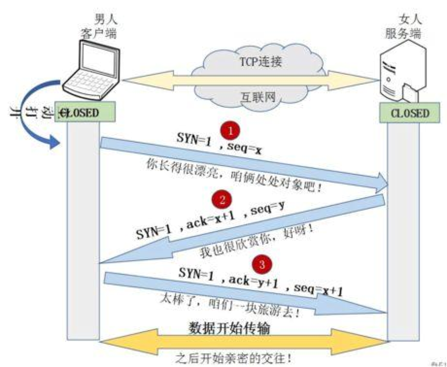
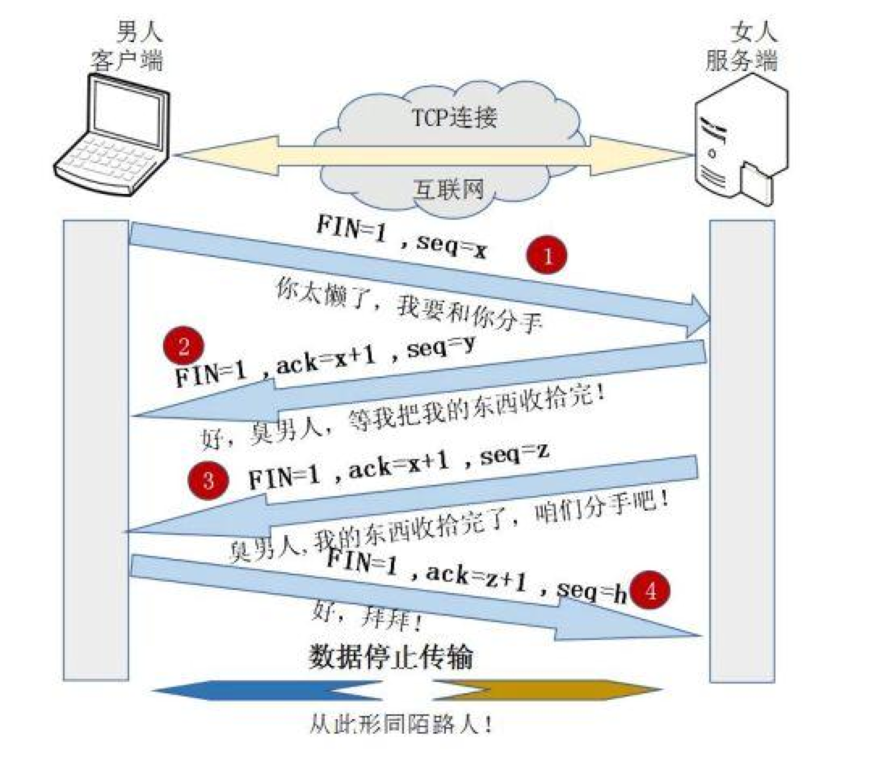

## 应用层（HTTP）

HTTP 本身是无状态协议，借助 cookie 和 session 记录状态。

其中 cookie 一般存储在浏览器端，而 session 一般存储在服务器端。

## 传输层（TCP/UDP）

### TCP

三次握手：

四次挥手：

### UDP

## 网络层（IP层）

ip 层主要考虑路由器之间的行为。

地址长度：

* ipv4：4byte
* ipv6：16byte

### 数据平面

数据平面指路由器内对 ip 和 mac 包头的处理和转发方式。

ip 包在路由器（网关）之间转发的时候一定会修改源头 MAC 地址为当前路由器，修改目标 MAC 地址为吓一跳或者目标客户端。

在普通情况下不会修改 ip 地址，但是在 NAT（network address translate）的情况下会修改源 ip 地址和目标 ip 地址。

### 控制平面

控制平面设计路由器内路由表的建立。其中主要有两种原理，DV（distance vector）基于贝尔曼富德算法和 LS（link status）基于地杰斯特拉。

DV 算法的代表是 RIP，BGP 协议，基本原理就是节点之间传输所有一直的路由表。缺点就是网络规模扩大之后效率太低，容易造成路由环路。各个节点不知道网络整体的拓扑形式。

BGP 一般用于 AS（Autonomous system），因为 AS 的数量非常有限，所以不会出现上述问题。

LS 算法的代表是OSPF，基本原理是节点之间只传输与自己直接相连的链路信息，每个节点搜集这些信息并建立整张图的拓扑结构，之后使用地杰斯特拉算法进行最短路计算。这种算法适用于更大形的网络。

## 数据链路层

### MAC 地址

长度为 6 byte。

MAC 地址是局域网之内的地址，用于定位一个网关之内的设备，跨过网管就无效了。

### ARP（Address Resolution Protocol）

ARP 的作用是根据 ip 地址获取 MAC 地址，简历 ip 和 MAC 的映射表。

其报文内主要包括：源MAC，目标MAC，源IP，目标IP

协议的工作过程为：

源节点发送广播 ARP 报文，目标 MAC 为全 1 的广播地址。

目标节点接受到广播报文之后附上自己的源 MAC 回复报文。使得源节点映射表完整，获得目标节点MAC 地址。

### 路由器（Gate way/Router）、交换机（switch）、集线器（hub）

交换机接口两两之间互为冲突域。

集线器同时只能运行两个接口，所以所有的接口都是冲突域。

广播域就是 MAC 地址的有效范围，或者 ARP 的广播有效范围，就是一个网关口内的局域网范围。

